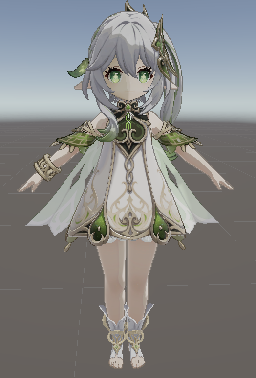
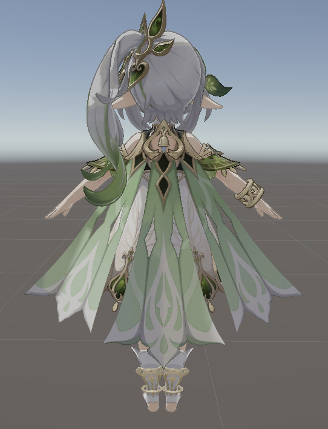

# NPR/PBR 角色渲染

Unity URP 项目，实现角色的 NPR（非真实感渲染）和 PBR（物理渲染）双风格切换。当前 NPR 渲染阶段已完成。

## NPR 效果预览

| 正面 | 背面 |
|---|---|
|  |  |

## NPR 阶段已完成

- [x] Face.shader — SDF 脸部方向阴影 + Ramp + MatCap + 描边
- [x] BodyAndHair.shader — ILM 四通道 NPR 管线 + Ramp 多行 + Blinn-Phong + MatCap + 多色描边
- [x] NahidaFaceScripts.cs — 脸部 SDF 方向向量实时控制
- [x] NahidaSmoothNormal.cs — 平滑法线烘焙（面积权重），解决硬边描边断裂
- [x] 纯菲涅尔边缘光
- [x] 抗锯齿（MSAA + SMAA）

## 待完成

- [ ] PBR 渲染模式
- [ ] NPR/PBR 运行时切换

## 环境

- Unity 6000.3.14f1
- URP 17.3.0

## 目录结构

```
Assets/
├── charactors/nahida/
│   ├── shaders/       # BodyAndHair.shader, Face.shader
│   ├── Materials/      # 22 个部位材质球
│   ├── tex/            # 漫反射、法线、ILM、Ramp、MatCap
│   ├── universals/     # 脸部 SDF、金属遮罩
│   ├── Scripts/        # NahidaFaceScripts.cs, NahidaSmoothNormal.cs
│   ├── others/         # PMX 原始模型、MMD4Mecanim 配置
│   └── 纳西妲.fbx      # 角色模型
├── Screenshots/        # 效果截图
└── Settings/           # URP 管线配置
```
