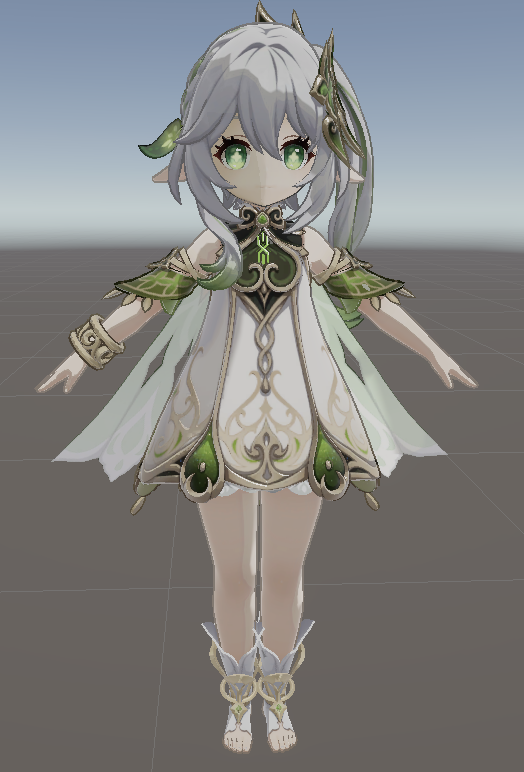
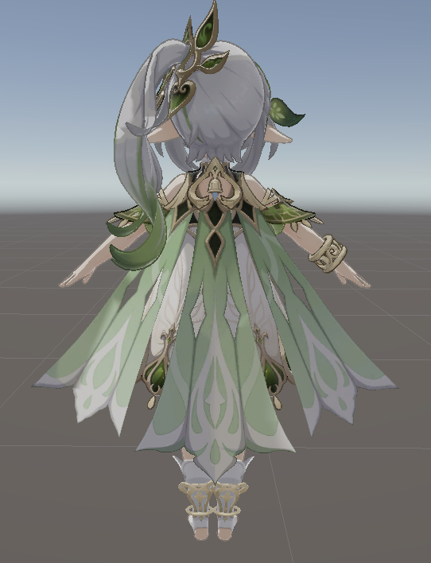

# NPR/PBR Hybrid 角色渲染

Unity URP 角色渲染展示项目，以纳西妲角色模型为载体，实现 NPR（非真实感渲染）与风格化 PBR 的混合对比。

项目目标不是做纯物理写实，而是探索一种更适合二次元角色的 Hybrid 管线：

```
NPR 负责：Ramp 阴影 / 脸部 SDF / 角色暗部色相 / 描边 / 风格化色彩
PBR 负责：法线细节 / 高光结构 / 金属感 / 光滑度 / 实时阴影
```

当前 NPR 管线已完成，PBR Hybrid 分支已接入 Body/Hair，并支持运行时分屏对比。

## 效果预览

| NPR 正面 | NPR 背面 |
|---|---|
|  |  |

## 当前状态

- [x] NPR 角色渲染完成
- [x] Body/Hair PBR 分支完成
- [x] PBR 暗部混合 NPR Ramp 色相
- [x] NPR/PBR 分割线实时对比工具
- [x] PBR 阴影抖动调优
- [ ] Face PBR/NPR Hybrid 统一
- [ ] 材质分区参数细化（皮肤 / 头发 / 布料 / 金属）
- [ ] README 展示截图更新为 NPR/PBR 对比图

## 核心功能

### NPR 渲染

- `Face.shader`
  - SDF 脸部方向阴影
  - Face Ramp 阴影色
  - MatCap 卡通光照
  - 纯菲涅尔边缘光
  - 背面膨胀描边

- `BodyAndHair.shader`
  - ILM 四通道 NPR 管线
  - 多行 Ramp 材质选择
  - Blinn-Phong 卡通高光
  - MatCap / Sphere 反射
  - 法线贴图细节
  - ILM.a 多色描边
  - 平滑法线描边修复

### PBR Hybrid 渲染

Body/Hair 的 PBR 分支复用现有 NPR 资产：

- `BaseTex`：漫反射 / 固有色
- `NormalMap`：切线空间法线
- `ILM.r`：金属度遮罩
- `ILM.g`：光滑度 / 阴影软硬度参考
- `ILM.b`：NPR 高光遮罩，仅轻量参与 occlusion
- `RampTex`：暗部色相来源

当前 Hybrid 策略：

```
UniversalFragmentPBR -> 计算 PBR 光照结构
NPR Ramp             -> 提供暗部色相和角色肤色氛围
stylizedShadowMask   -> 控制 PBR 向 NPR 暗部混合
```

这样可以保留 PBR 的高光、金属和法线结构，同时避免 Unity 原生 PBR 阴影把角色暗部压黑，或用加法补光把皮肤和白发冲白。

### 分屏对比工具

`SplitScreenController.cs` 提供运行时分割线控制：

- 左键拖拽：旋转分割线
- 右键拖拽：平移分割线
- `R`：重置分割线

Shader 内部按屏幕坐标逐像素选择渲染分支：

```
splitSide > 0  -> NPR
splitSide <= 0 -> PBR Hybrid
```

该方案为单相机、单 Pass、逐像素分支，不需要额外双相机合成。

## 关键技术记录

- SDF 脸部方向阴影
- ILM 四通道材质控制
- Ramp 多行材质阴影
- MatCap 卡通光照
- Inverted Hull 描边
- UV3 平滑法线描边修复
- 菲涅尔边缘光
- URP `UniversalFragmentPBR` 接入
- PBR 暗部混合 NPR Ramp 色相
- Shadow Map 分辨率 / Bias / Cascade / Distance 调优
- NPR/PBR 屏幕分割线实时对比

详细推导和踩坑记录见 [DEVLOG.md](DEVLOG.md)。

## 环境

- Unity 6000.3.14f1
- URP 17.3.0
- Input System 1.19.0

## 目录结构

```
Assets/
├── charactors/nahida/
│   ├── shaders/       # Face.shader, BodyAndHair.shader, SplitScreen.shader
│   ├── Materials/      # 角色各部位材质球
│   ├── tex/            # 漫反射、法线、ILM、Ramp、MatCap
│   ├── universals/     # 脸部 SDF、金属遮罩
│   ├── Scripts/        # SDF 控制、平滑法线、分屏控制
│   ├── others/         # PMX 原始模型、MMD4Mecanim 配置
│   └── 纳西妲.fbx      # 角色模型
├── Screenshots/        # 展示截图
├── Scenes/             # Unity 场景
└── Settings/           # URP 管线配置
```

## 后续计划

- 给 `Face.shader` 增加 PBR/NPR Hybrid 统一逻辑
- 使用 `ILM.a` 或额外 Mask 区分皮肤、头发、布料、金属参数
- 为头发增加更明确的风格化高光控制
- 补充 PBR 专用 AO/Cavity、Roughness/Smoothness 资产
- 更新展示截图，加入 NPR/PBR 分屏对比图
- 增加 Debug 视图：ILM、Ramp、Metallic、Smoothness、Shadow Mask
